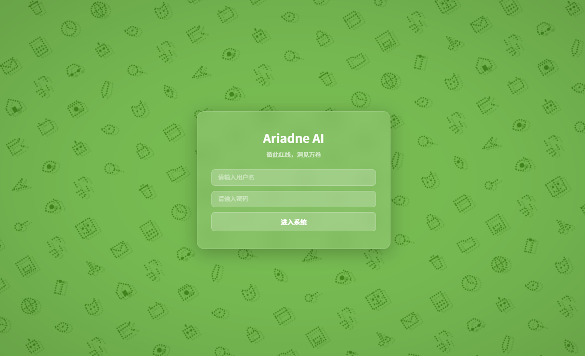
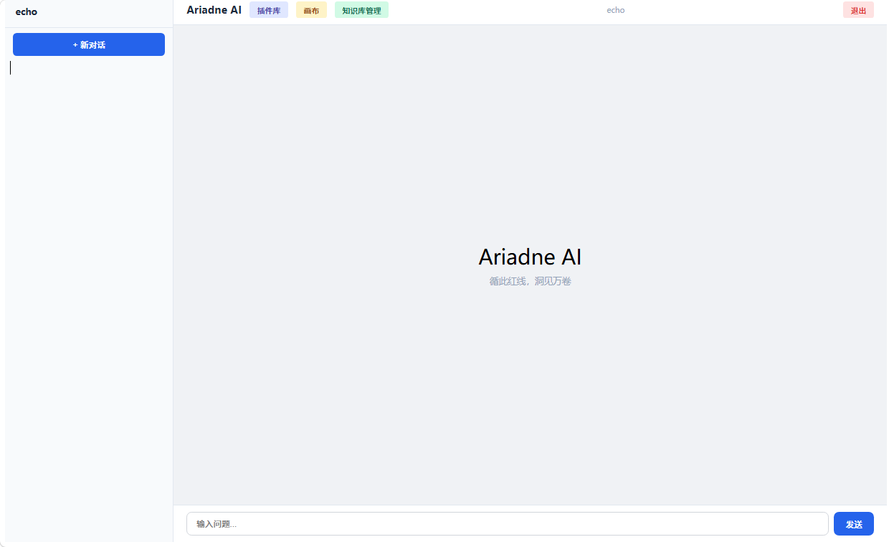
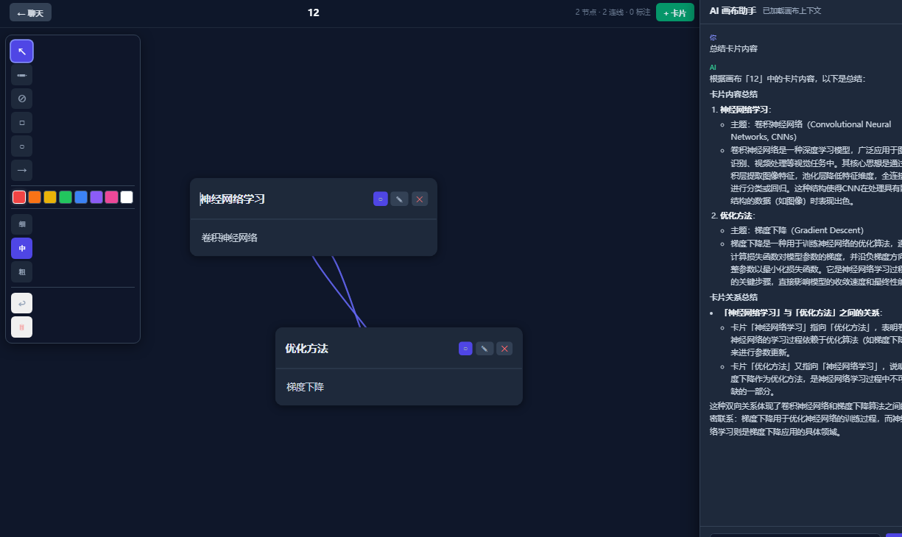

Markdown
# Ariadne

> **循此红线，洞见万卷。**  
> *“Traced by the red thread, escaping the labyrinth of endless text.”*

<p align="center">
  <a href="#-the-legend">名字的浪漫</a> •
  <a href="#-visual-gallery">视觉长廊</a> •
  <a href="#-a-day-in-the-life">交互微剧场</a> •
  <a href="#-anatomical-breakdown">模块的生命力</a> •
  <a href="#-architecture">工程脉络</a> •
  <a href="#-quick-start">点亮红线</a>
</p>

---

## 🧭 The Legend | 名字的浪漫

在古希腊神话中，克里特岛（Crete）的迷宫由巨匠代达罗斯（Daedalus）亲手筑造。迷宫里没有任何死胡同，但每一个转角都与成百上千个相似的通道交错。踏入其中者，并不会碰壁，而是在无穷无尽、大同小异的选择中逐渐耗尽气力，最终迷失。

在数字化时代，**知识的困境也是如此**：
我们不缺文档。数以百计的学术 PDF、工作周报、技术白皮书和代码库，交织成了现代人的“代达罗斯迷宫”。在这个迷宫里，你很难找到一堵直接挡住你的“死墙”，但你会在无数个语义相近的段落和数据中打转，迷失方向。

**Ariadne**（阿里阿德涅）正是为了给你递上一根突破迷雾的“红线”而生：
*   **你**，是踏入知识迷宫的行者（Theseus）。
*   **Ariadne**，不在迷宫里凭空创造路标，而是**通过一根由语义、上下文与逻辑编织而成的红线**，一头系在你的问题上，一头探入知识的最深处，带你安全折返。

---

## 🖼️ Visual Gallery | 视觉长廊

我们坚信，工具的优雅不仅在于代码的严谨，更在于交互时的呼吸感。以下是 Ariadne 的视觉呈现：

### 1. 🌌 动态麦金塔登录界面 (`login.png`)
*   **设计美学**：登录页面的背景并非枯燥的静态图片，而是向早期 **Macintosh (麦金塔) 经典像素屏保壁纸** 致敬的动态画布。
*   **物理动态**：它拥有“生命力”——能够根据你当前设备的**实际时间**动态变幻微光的色彩，并以极简的像素图标在后台无声漂移。每一次清晨、午后或深夜打开，它都呈献出与此刻日光、月色相契合的独特视觉氛围。

<p align="center">
  
</p>

### 2. 🖥️ 主交互白板界面 (`main.png`)
*   **设计美学**：主界面摒弃了传统的“单调聊天流”排版。
*   **工作流体验**：采用毛玻璃质感的分栏设计，将“对话、文档上下文、系统分析状态”有机地聚合在同一个视野中。无需在多个页面间来回跳转，阅读与思考的过程连贯而纯粹。

<p align="center">
  
</p>

### 3. 🗂️ 知识卡片与记忆视图 (`knowledge.png`)
*   **设计美学**：这是红线将海量碎片缝合而成的“实体”。
*   **物理呈现**：你上传的文档、网页和本地笔记，会在此处被解构、沉淀，并以轻量级的“知识卡片”形式陈列。双击任何一张卡片，即可拉起该文献在向量记忆深处的全部上下文脉络，一览无余。

<p align="center">
  
</p>

---

## 🎬 A Day in the Life | 交互微剧场

为了让你直观感受 Ariadne 的温度，不妨想象这样一个日常场景：

> **场景**：你刚刚接手了一个拥有数万行代码和几百页老旧设计文档的庞大开源项目。你需要立刻找出其中 `session` 模块在异常断网时的重连机制。
> 
> *   **传统方式**：你打开搜索，输入 `reconnect`，得到了 200 个匹配结果。你开始一页页点开，在无数个类似的代码块里昏昏欲睡。
> *   **Ariadne 的红线**：
>     1.  你上传了所有的设计文档，并在对话框里敲下：*“帮我看看，当网络断开时，系统是如何尝试重连的？有次数限制吗？”*
>     2.  **Router** 敏锐地捕捉到了你的意图，它明白这不是一个简单的定义查询，而是一个需要“时序推导”的复杂问题。
>     3.  **Long Memory** 在向量空间里瞬间穿梭，顺着红线，在 300 页文档的第 12 页（协议描述）和第 142 页（异常类设计）找到了线索，并将它们拽入 **Fast Memory**。
>     4.  **Reviewer** 在后台静静审视，发现生成的草稿中将“最大重连 3 次”误写成了“5 次”，它立刻对照原文进行纠偏，擦除幻觉。
>     5.  最终，你得到了一个干净、精准、带引用出处的回答：*“系统会在网络断开 5 秒后启动指数退避重连，最大限制为 3 次，详见文档《API设计协议》第 12 页。”*

这一套行云流水的动作，全部在几秒钟内无声完成。

---

## 🧠 Anatomical Breakdown | 模块的生命力

Ariadne 拒绝堆砌无意义的工程复杂性。它的每一个组件都如同身体的器官，有着明确的职责和默契的配合：

### 🚦 意图路由器 (Router) —— 敏锐的耳目
并非所有的提问都需要大海捞针，也并非所有的闲聊都需要调动整座图书馆。
*   **功能描述**：Router 是系统的门卫。它通过极轻量的语义分析，在毫秒级内判断你的输入是简单的日常寒暄、复杂的学术检索，还是需要调用外部工具（比如计算器、统计插件）的特定任务。
*   **生动细节**：当你说 *“你好啊”*，它会温柔地直接回应；当你说 *“帮我算一下这篇报告里第三章的数据总和”*，它会微笑着将任务派发给 **Calculator** 插件，绝不走一丝弯路。

### 🧠 快闪与长效记忆 (Fast & Long Memory) —— 呼吸与烙印
人脑的记忆分为瞬时和长效，Ariadne 亦然。
*   **Fast Memory (会话快闪)**：它就像你摊在书桌上、正拿在手里写写画画的草稿纸。它只负责保存当前对话的上下文、语气和刚刚提到的代词。它转瞬即逝，却保证了对话的流畅和自然。
*   **Long Memory (长效沉淀)**：它是你书架上整齐码放的硬壳书。它通过本地向量化技术（Vector Store），将你上传的所有 PDF 和 Markdown 默默解构成一片拥有无限维度的“知识星空”。

### ⚖️ 结果审校者 (Reviewer) —— 严苛的考证癖
模型的“幻觉”就像迷宫里的海市蜃楼，常常让人信以为真。
*   **功能描述**：Reviewer 是一个静态的后台质检员。在任何答案返回给你之前，它都会拿出一张严格的核对清单（Checklist）：*这句话在原文里有根据吗？数据来源是否对得上？是不是模型自己编造的？*
*   **生动细节**：如果大模型在生成答案时，凭空捏造了一个并不存在的概念，Reviewer 会在后台直接“驳回重写”，直到答案中的每一个字、每一次引用都铁证如山。

---

## 🏗️ Technical Architecture | 工程脉络

如果你想深入阅读或修改代码，可以顺着以下脉络探索 Ariadne 的身体：

```text
ariadne/
├── core/               
│   ├── agent.py            # 主代理：红线的提灯人，负责协调全局
│   ├── router.py           # 意图路由器：识别任务分流，拒绝大炮打蚊子
│   ├── reviewer.py         # 审校机制：后台纠偏，斩断一切无端幻觉
│   ├── context_builder.py  # 上下文组装：将记忆碎片缝合成最舒适的阅读格式
│   └── history.py          # 记忆轨：记录你与系统的每一次呼吸和交互
├── memory/             
│   ├── fast_memory.py      # 短期记忆：聚焦于眼前的草稿纸
│   ├── long_memory.py      # 长期记忆：负责将远处的星群（向量）归位
│   └── vector_store.py     # 向量基座：知识持久化的物理温床
├── plugins/            
│   ├── calculator/         # 精准计算：涉及数字，绝不用感性的大模型猜测
│   ├── canvas_md/          # 画布白板：将文字转化为可视化的 Markdown 渲染
│   └── doc_stats/          # 文档度量：一秒看透上传文档的字数与结构
├── tools/              
│   └── pdf_page_reader.py  # 解析利刃：干净利落地剖开 PDF，提取最纯粹的文本
└── frontend/           
    └── src/                # 极简、清爽的毛玻璃交互面板 (基于 React 与 Vite)
## 🛠️ Quick Start | 点亮红线

### 方式一：快速部署（推荐，生产模式）

```bash
git clone https://github.com/echolear123/ariadne-ai.git
cd ariadne-ai

# 1. 安装依赖
pip install -r requirements.txt

# 2. 配置环境变量
cp .env.example .env
nano .env   # 填入你的 SiliconFlow API Key，其他保持默认即可

# 3. 启动（单命令，含前端）
python run.py
```

打开浏览器访问 **http://localhost:7860**，使用默认账号 `echo` / `echo123` 登录。

### 方式二：开发模式（前后端分离）

```bash
# 终端 1：启动后端
python app.py

# 终端 2：启动前端开发服务器
cd frontend
npm install
npm run dev
```

前端开发服务器默认运行在 **http://localhost:5173**，会自动代理 API 请求到后端 7860 端口。

### .env 配置说明

```bash
# 必填：SiliconFlow API Key（在 https://siliconflow.cn 注册获取）
SF_API_KEY=sk-xxxxxxxxxxxxxxxx

# 以下为可选配置，保持默认即可正常使用
SF_BASE_URL=https://api.siliconflow.cn/v1
LLM_MODEL=Qwen/Qwen3-8B
EMBEDDING_MODEL=BAAI/bge-large-zh-v1.5
WEB_HOST=0.0.0.0
WEB_PORT=7860
```

> **注意**：配置值不要加引号或反引号，直接写即可。例如 `SF_API_KEY=sk-xxx` 而不是 `SF_API_KEY="sk-xxx"`。

### 方式三：Docker 部署

```bash
docker build -t ariadne-ai .
docker run -p 7860:7860 -e SF_API_KEY=sk-xxx ariadne-ai
```

🤝 Contribution & License | 协力与许可
Ariadne 采用 Apache-2.0 许可证开源。

我们不希望 Ariadne 成为一个冷冰冰的、被大公司垄断的代码堆。它属于每一个讨厌在文档堆里浪费生命的开发者。如果你有更好的解析算法、更聪明的检索思路、或者发现了一个小 Bug，请毫不犹豫地向我们提交 Pull Request。

让我们共同编织这根能够穿透迷雾的红线。